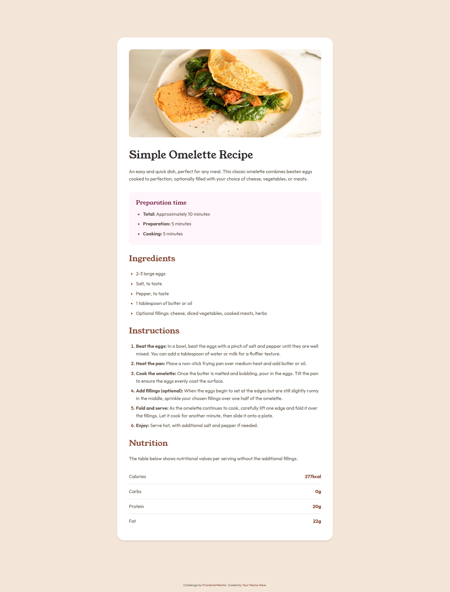

# Frontend Mentor - Recipe page solution

This is a solution to the [Recipe page challenge on Frontend Mentor](https://www.frontendmentor.io/challenges/recipe-page-KiTsR8QQKm). Frontend Mentor challenges help you improve your coding skills by building realistic projects.

## Table of contents

- [Overview](#overview)
  - [The challenge](#the-challenge)
  - [Screenshot](#screenshot)
  - [Links](#links)
- [My process](#my-process)
  - [Built with](#built-with)
  - [What I learned](#what-i-learned)
  - [Continued development](#continued-development)
  - [Useful resources](#useful-resources)
- [Author](#author)

## Overview

### The challenge

Build a recipe page that matches the given design as closely as possible. The page should:

- Display a recipe with image, ingredients, instructions, and nutritional information
- Be responsive and work well on both mobile (375px) and desktop (1440px) devices
- Use semantic HTML for accessibility
- Match the color scheme and typography from the style guide

### Screenshot



### Links

- Solution URL: [GitHub Repository](https://github.com/yourusername/recipe-page)
- Live Site URL: [Live Demo](https://gleeful-sprite-aea882.netlify.app/)

## My process

### Built with

- Semantic HTML5 markup (main, article, section elements)
- CSS custom properties for design system
- Flexbox for layout
- CSS Grid for nutrition table
- Mobile-first responsive design
- Google Fonts (Young Serif & Outfit)

### What I learned

This project reinforced several key concepts:

**CSS Custom Properties for Design Systems:**

```css
:root {
  --stone-600: hsl(30, 10%, 34%);
  --brown-800: hsl(14, 45%, 36%);
  --rose-800: hsl(332, 51%, 32%);
}
```

**Semantic HTML Structure:**

```html
<article class="recipe-card">
  <section class="preparation-time">
    <h2>Preparation time</h2>
    <ul>
      <li><strong>Total:</strong> Approximately 10 minutes</li>
    </ul>
  </section>
</article>
```

**Custom List Marker Styling:**

```css
.ingredients ul li::marker {
  color: var(--brown-800);
}
```

### Continued development

Areas I want to focus on in future projects:

- Advanced CSS animations and transitions
- Better accessibility with ARIA labels
- CSS Grid for more complex layouts
- Performance optimization techniques

### Useful resources

- [MDN CSS Custom Properties](https://developer.mozilla.org/en-US/docs/Web/CSS/--*) - Great reference for CSS variables
- [CSS-Tricks Flexbox Guide](https://css-tricks.com/snippets/css/a-guide-to-flexbox/) - Comprehensive flexbox reference
- [Google Fonts](https://fonts.google.com/) - For typography implementation

## Author

- Frontend Mentor - [@afuhflynn](https://www.frontendmentor.io/profile/afuhflynn)
- GitHub - [@afuhflynn](https://github.com/afuhflynn)
